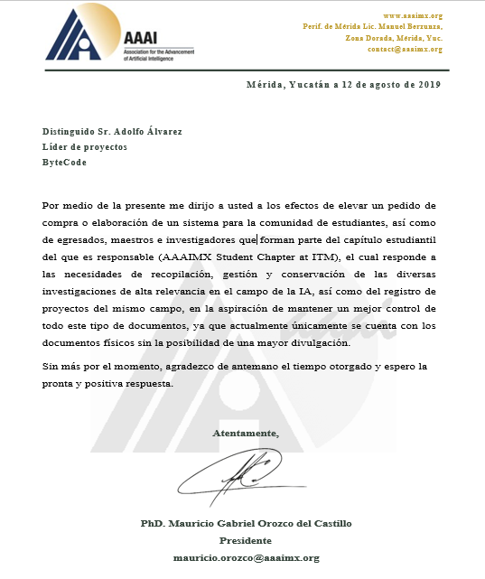
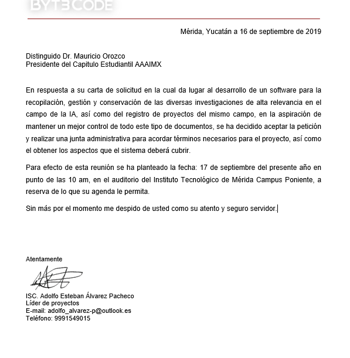

* ## 1 INTRODUCCIÓN ##

 En este capítulo se detallan los elementos propios de la problemática que resolverá el proyecto, así como las especificaciones que se tomarán para abordarlo, como los objetivos, las limitaciones y los alcances. 

* ### **1.1 Antecedentes** ###

El Departamento de Sistemas y Computación actualmente está formado principalmente por estudiantes, maestros e investigadores de diversos centros de investigación y universidades de la región. Es por ello, que la mayoría de los trabajos de productividad, es decir, proyectos, artículos, tesis, etc., se encuentran publicados o recopilados en diversas revistas de investigación o físicamente como documentos dentro del plantel educativo. 
Cada año se platean nuevos proyectos, miembros, eventos y demás trabajos de productividad por lo que el almacenamiento de la información va creciendo de modo que cada vez más personas van colaborando con la organización con el fin de impulsar su desarrollo profesional y contribuir de esta manera al desarrollo tecnológico del país en áreas como inteligencia artificial, prototipos y desarrollo de software.

* ### **1.2 Planteamiento de problema** ###

Debido a que el giro principal del capítulo estudiantil es la divulgación científica, el acercamiento con la comunidad es muy importante, pues a través del sistema se dan a conocer todos los proyectos académicos y permite que los interesados (Institutos, alumnos o investigadores) puedan conocer acerca de cómo colaborar con ellos.
 Al sistema que ahora se encuentra en funcionamiento se le harán actualizaciones, específicamente en estadísticas y ventanas emergentes, puesto que son funcionalidades que son requeridas y servirán de ayuda para el escalamiento del sistema.

* ### **1.3 Objetivos** ###
    * ### **1.3.1 General** ###
    
Debido a que el giro principal del capítulo estudiantil es la divulgación científica, el acercamiento con la comunidad es muy importante, pues a través del sistema se dan a conocer todos los proyectos académicos y permite que los interesados (Institutos, alumnos o investigadores) puedan conocer acerca de cómo colaborar con ellos.
    Al sistema que ahora se encuentra en funcionamiento se le harán actualizaciones, específicamente en estadísticas y ventanas emergentes, puesto que son funcionalidades que son requeridas y servirán de ayuda para el escalamiento del sistema.
    
 

    * ### **1.3.2 Específico** ###
    ●	Rediseñar la base de datos relacional actual que alberga información acerca de textos académicos, publicaciones y personal de investigación del capítulo, para mejorar sus funcionalidades y escalamiento.

    ●	Rediseñar la base de datos relacional que trata con las operaciones relacionadas a la organización de eventos en el capítulo, para mejorar sus funcionalidades y escalamiento. 

    ●	Rediseñar la base de datos relacional que permite administrar las operaciones financieras del capítulo estudiantil, para mejorar sus funcionalidades y escalamiento.

    ●	Agregar un módulo de ventanas emergentes para mejorar la practicidad al momento de dar registro y seguimiento a nuevos usuarios que no se encuentren anexados al sistema, puesto que reduce el tiempo y espera de indexación de nuevos datos.

* ### **1.4 Justificación** ### 
    * ### **1.4.1 Alcances** ###
    ●	Se mantendrán los módulos de altas y bajas de información, que están al tanto de los textos académicos de la plataforma como de sus integrantes.

    ●	Se mantendrán las vistas para el filtrado, búsqueda y selección de la información mencionada anteriormente.

    ●	Se actualizará el sistema de administración de finanzas del capítulo, siguiendo estándares de transparencia de recursos.

    ●	Se actualizará el sistema de administración de eventos del capítulo, que permita crear, borrar y manipular los eventos que organicen.

    ●	Se mantendrá el sistema de autenticación actual que permite que sólo personas autorizadas tengan acceso a las herramientas administrativas de la plataforma.

    ●	Se agregará un módulo que anexe ventanas emergentes, que permite la agilización de registros de datos a nuevos usuarios en el sistema.

    * ### **1.4.2 Limitaciones** ###
  
Antes de comenzar el proyecto, el cliente solicitó servicios de desarrollo de software para resolver la problemática presentada en el capítulo estudiantil. Se anexa el documento a continuación:
    
 

 * ### **1.5 Carta de solicitud** ###

Antes de comenzar el proyecto, el cliente solicitó servicios de desarrollo de software para resolver la problemática presentada en el capítulo estudiantil. Se anexa el documento a continuación:

 * ### **1.6 Carta de respuesta del cliente** ###

Se respondió a tal solicitud con miras a establecer un contrato futuro entre el capítulo y la agencia de desarrollo de software. Se anexa el documento a continuación:

 * ### **1.7 Diagrama de Gantt** ###

Después de establecer el contrato con el cliente, se procedió a planificar el proyecto a través de un diagrama de Gantt (ver figura 1).

Figura 1 Diagrama de Gantt del proyecto

